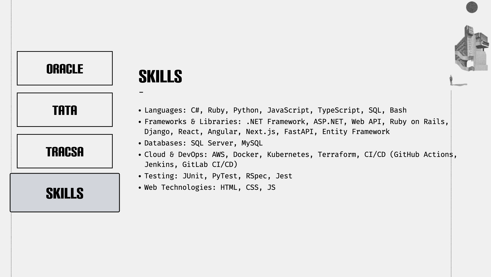
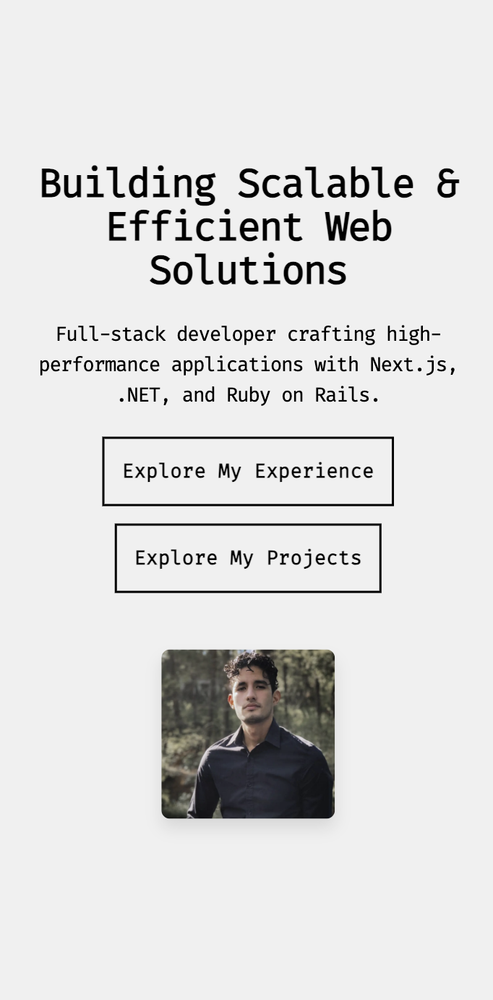

# 🧱 Brutalist Developer Portfolio — Alejandro Farias

This is my personal developer portfolio, built with a bold, minimalist brutalist design.  
It reflects my personality: direct, fast, and focused on delivering real-world results.

No fluff — just clean architecture, raw typography, and projects that speak for themselves.

---

## 🌐 Live Site

👉 [Site](https://alejandrofarias.netlify.app/)

---

## 🚀 Tech Stack

**Frontend**
- Next.js 14 (App Router)
- React
- TypeScript
- Tailwind CSS

**UX / Extras**
- Framer Motion (subtle animations)
- Markdown content support
- Responsive design
- Dark mode

**Hosting**
- Vercel

---

## Video

[Link](https://youtu.be/_WrD7tvm6w4)

---

## 📸 Screenshots

### 🏠 Homepage

### 🧠 Skills Details

### 📱 Mobile View

---

## 🧩 Features

- ✅ Brutalist-inspired layout: minimal colors, clear hierarchy, strong typography
- ✅ Fully responsive design
- ✅ Projects with GitHub + live demo links
- ✅ Lighthouse optimized (100 performance)
- ✅ Markdown-based content for easy updates
- ✅ Clean folder structure and component-based architecture

---

## 💡 Design Philosophy

> *"The code is the design."*

This site isn't about flashy animations or glossy UI.  
It's about clarity, intention, and showcasing how I think and build.

If you're looking for someone who prioritizes function, performance, and developer empathy — let's talk.

---

## 👨‍💻 About Me

I'm **Alejandro Farias**, a software and mechatronics engineer based in Texas.  
I specialize in fullstack development and have experience in:

- Frontend: React, Next.js, Tailwind, Framer Motion
- Backend: FastAPI, Django, Ruby on Rails
- DevOps: Docker, GitHub Actions, Kubernetes
- AI integration: OpenAI, DeepSeek, LangChain
- Real-world systems: from ATS optimizers to industrial automation tools

Currently open to full-time, contract, or freelance opportunities — remote or hybrid.

---

## 📫 Contact Me

- 🌐 [Portfolio](https://alejandrofarias.netlify.app/)
- 📧 [Email](mailto:alejandrofariaslozoya@gmail.com)
- 💼 [LinkedIn](https://www.linkedin.com/in/cfariaslozoya)
- 💻 [GitHub](https://github.com/ElGuitarrero)

---

Made with ❤️ and a touch of brutalism.